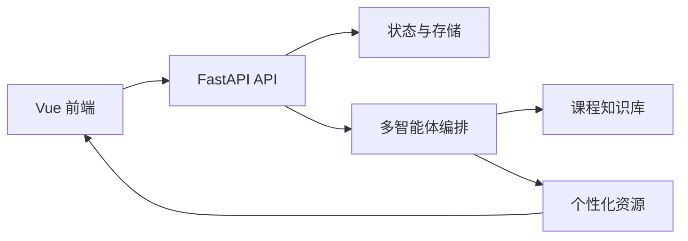
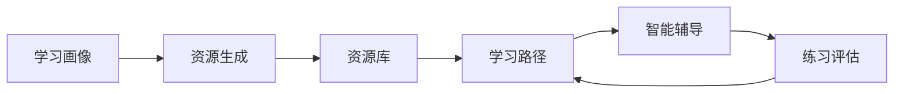

# PPT 大纲（12 页以内）

建议控制在 10-12 页，答辩时重点讲清楚“为什么做、怎么做、做到了什么、如何演示”。

## 1. 标题页

标题：

> 基于大模型的个性化学习资源生成与学习多智能体系统

副标题：

> 面向“人工智能导论”课程的学习画像、资源生成与评估闭环

页面内容：

- 项目名称
- 团队/作者
- 技术栈：Vue 3、FastAPI、Pydantic、SQLite、MockLLMProvider

## 2. 背景与痛点

要讲什么：

- 高校课程中学生基础差异大
- 通用学习资源难以匹配个人薄弱点
- 学习路径缺少动态反馈
- 生成式 AI 容易缺少来源和过程可解释性

建议配图：

- “学生画像 -> 资源 -> 练习 -> 反馈”的问题链路图

## 3. 项目目标

要讲什么：

- 通过自然语言构建学习画像
- 通过多智能体生成多类型学习资源
- 通过 Agent Trace 展示生成过程
- 通过练习评估动态调整学习路径

一句话总结：

> 让课程学习从“统一资源发放”变成“基于画像和反馈的个性化学习闭环”。

## 4. 系统架构

页面内容：

- 前端：Vue 3、Vue Router、Pinia、Vite
- 后端：FastAPI、Pydantic
- 数据：SQLite 本地持久化、课程知识库
- 智能体：Orchestrator + 多个 Agent
- 接口：统一 `{ ok, data, error }` 响应

建议配图：

## 5. 对话式学习画像

要讲什么：

- 不使用长表单，而是通过对话提取画像
- 画像维度包括专业、课程、知识基础、学习目标、认知风格、偏好模态、时间预算、薄弱点、错误模式、掌握度
- 画像有版本号，后续资源和路径基于画像生成

建议截图：

- `/profile` 页面

## 6. 多智能体协同

页面内容：

| 智能体 | 作用 |
| --- | --- |
| KnowledgeAgent | 检索课程知识点和来源 |
| PlannerAgent | 规划资源组合 |
| LectureAgent | 生成讲解文档 |
| MindMapAgent | 生成 Mermaid 导图 |
| QuizAgent | 生成分层练习 |
| ReadingAgent | 生成拓展阅读 |
| MediaAgent | 生成视频/动画脚本 |
| CodeCaseAgent | 生成代码案例 |
| ReviewAgent | 检查来源、难度和安全状态 |

建议截图：

- `/generate` 的 Agent Trace 区域

## 7. 个性化资源生成

要讲什么：

- 一次生成 6 类资源
- 支持 Markdown、Mermaid、JSON、Code 等内容格式
- 每份资源带来源引用、审核状态、创建智能体和目标画像

建议截图：

- `/resources` 资源库
- 资源详情内容

## 8. 防幻觉与可解释性

要讲什么：

- 课程知识库提供来源基础
- `source_refs` 标记资源来源
- `review_status` 标记审核状态
- Agent Trace 展示每一步输入、输出、来源和置信度

强调：

> 我们不只展示最终生成结果，也展示生成过程和审核结果。

## 9. 学习路径与评估闭环

要讲什么：

- 学习路径根据画像和资源生成
- 每一步包含目标、推荐资源、推荐理由和预计时间
- 练习提交后生成评估报告
- 评估结果反向调整掌握度、薄弱点和学习路径

建议截图：

- `/path`
- `/assessment`

## 10. 演示流程

建议放一张流程图：

讲解顺序：

1. `/profile` 输入学生情况
2. `/generate` 启动资源生成
3. `/resources` 查看资源
4. `/path` 查看学习路径
5. `/tutor` 提问
6. `/assessment` 提交练习并查看路径调整

## 11. 测试与交付

页面内容：

- API 契约文档：`docs/api-contract.md`
- 后端测试：`.\.venv\Scripts\python.exe -m pytest tests -p no:cacheprovider`，当前 6 个测试通过
- 前端构建：`npm run build` 通过
- 最终检查清单：`docs/delivery/final-checklist.md`
- 演示 Runbook：`docs/delivery/demo-runbook.md`

强调：

- 前后端契约已对齐
- 错误响应统一
- 页面主链路可演示

## 12. 创新点与后续扩展

创新点：

- 对话式动态画像
- 多智能体可观察协作
- 多类型个性化资源生成
- 来源引用和审核状态降低幻觉风险
- 练习评估反向调整学习路径

后续扩展：

- 接入真实大模型
- 接入真实课程平台和学生数据
- 增加用户登录和多用户画像
- 增强资源持久化和异步任务队列
- 增加更完整的 Markdown/可视化渲染
