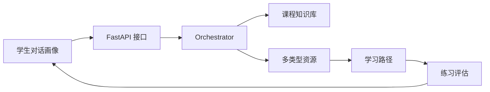

# 演示与答辩手册

本文档用于你独立完成项目答辩、录制演示视频或向同学介绍项目。建议答辩前先熟悉 `demo-runbook.md`、`demo-video-script.md` 和 `ppt-outline.md`。

## 1. 一句话介绍

> 这是一个面向高校课程学习的个性化资源生成系统，它通过对话构建学生画像，再由多个智能体协同生成讲解、导图、练习、阅读、视频脚本和代码案例，并根据练习评估结果动态调整学习路径。

## 2. 30 秒版本

> 项目以“人工智能导论”为样例课程，解决学生基础差异大、学习资源不够个性化、学习路径缺少反馈的问题。系统包含 Vue 前端和 FastAPI 后端，前端展示画像、资源、路径、导师和评估闭环；后端通过多智能体编排生成资源，并记录 Agent Trace、来源引用和审核状态。整个系统可以本地运行，不依赖真实模型 Key，适合稳定演示。

## 3. 2 分钟版本

> 我们的项目不是一个普通问答机器人，而是一个课程学习闭环系统。首先，学生通过自然语言描述自己的基础、目标和困惑，系统抽取学习画像，包括知识基础、薄弱点、学习目标、学习偏好和掌握度。然后，后端 Orchestrator 调度多个智能体：KnowledgeAgent 检索课程知识，PlannerAgent 规划资源组合，LectureAgent、MindMapAgent、QuizAgent、ReadingAgent、MediaAgent 和 CodeCaseAgent 分别生成不同形式的学习资源，ReviewAgent 负责审核来源和安全状态。前端会展示完整 Agent Trace，让评委看到生成过程不是黑盒。最后，学生提交练习后，系统生成评估报告，并反向调整画像和学习路径，形成“画像 -> 资源 -> 路径 -> 练习 -> 再推荐”的闭环。

## 4. 项目亮点

1. 对话式画像  
   不用长表单，通过自然语言更新学习画像，并维护版本。

2. 多智能体协作  
   不同 Agent 分工生成资源，前端展示 Trace，过程可观察。

3. 多类型资源生成  
   一次生成讲解、导图、练习、阅读、视频脚本和代码案例。

4. 防幻觉设计  
   资源带 `source_refs`，并通过 `review_status` 展示审核结果。

5. 学习闭环  
   练习评估会影响掌握度、薄弱点和下一步学习路径。

6. 稳定可演示  
   使用 MockLLMProvider，不依赖真实 API Key，适合比赛或课堂演示。

7. 工程可维护  
   前端有统一 API 封装、类型定义、Pinia 状态管理和公共资源渲染组件；后端有统一响应 envelope、Pydantic schema、SQLite 状态恢复和接口测试。

## 5. 技术架构说明

前端：

- Vue 3
- Vite
- TypeScript
- Vue Router
- Pinia
- Mermaid 渲染
- Markdown 轻量渲染
- 资源详情公共组件

后端：

- FastAPI
- Pydantic
- SQLite 本地存储
- 自研轻量 Orchestrator
- MockLLMProvider

核心数据流：



核心接口：

- `POST /api/profile/chat`
- `POST /api/resources/generate`
- `GET /api/resources`
- `GET /api/learning-path/current`
- `POST /api/tutor/chat`
- `POST /api/quiz/submit`

统一响应：

```json
{
  "ok": true,
  "data": {},
  "error": null
}
```

统一错误：

```json
{
  "ok": false,
  "data": null,
  "error": {
    "code": "RESOURCE_NOT_FOUND",
    "message": "resource not found",
    "details": {}
  }
}
```

## 6. API 与前后端协作说明

前后端协作基于 `docs/api-contract.md`。前端同学只需要关注三点：

1. 所有接口统一返回 `{ ok, data, error }`。
2. 成功时读取 `data`，失败时读取 `error.code` 和 `error.message`。
3. 资源生成、路径、测评报告都使用稳定字段结构，前端不需要理解后端内部 Agent 实现。

典型页面和接口关系：

| 页面 | 主要接口 | 用途 |
| --- | --- | --- |
| 工作台 | `GET /api/profile/current`、`GET /api/resources`、`GET /api/learning-path/current`、`GET /api/assessment/report` | 加载总览数据 |
| 学习画像 | `POST /api/profile/chat`、`GET /api/profile/current` | 更新并展示学生画像 |
| 资源生成 | `POST /api/resources/generate`、`GET /api/jobs/{job_id}` | 生成资源、展示任务状态和 Agent Trace |
| 资源库 | `GET /api/resources`、`GET /api/resources/{resource_id}` | 展示资源列表和详情 |
| 学习路径 | `GET /api/learning-path/current`、`POST /api/learning-path/generate` | 展示和重新生成路径 |
| 智能辅导 | `POST /api/tutor/chat` | 基于课程语境回答问题 |
| 练习评估 | `POST /api/quiz/submit`、`GET /api/assessment/report` | 提交答案并展示报告 |

答辩时可以这样讲：

> 我们先写了 API 契约文档，再让前后端按统一响应结构联调。这样前端页面只依赖稳定字段，不依赖后端内部实现；后端也通过测试保证核心接口结构不漂移。

## 7. 演示前检查

后端：

```bash
cd backend
uvicorn app.main:app --reload
```

前端：

```bash
cd frontend
npm run dev
```

验证：

```bash
cd backend
.\.venv\Scripts\python.exe -m pytest tests -p no:cacheprovider
```

```bash
cd frontend
npm run build
```

访问：

- 前端：`http://127.0.0.1:5173`
- 后端健康检查：`http://127.0.0.1:8000/api/health`

## 8. 推荐演示路径

完整现场版见 `demo-runbook.md`。答辩时推荐按下面顺序：

1. 工作台 `/`  
   展示系统总览、指标和闭环入口。先让评委看到这是完整系统，不是单页面 demo。

2. 学习画像 `/profile`  
   输入：

```text
我线性代数比较薄弱，希望多给 Python 代码案例和图解。
```

3. 资源生成 `/generate`  
   点击“启动生成”，展示进度、Agent Trace 和生成结果。

4. 资源库 `/resources`  
   展示不同类型资源、来源引用、审核状态和创建智能体。

5. 学习路径 `/path`  
   展示路径步骤、推荐资源和推荐理由。

6. 智能辅导 `/tutor`  
   提问：

```text
为什么训练准确率高，测试效果仍然可能不好？
```

7. 练习评估 `/assessment`  
   提交默认答案，展示分数、反馈和路径调整。

8. 回到工作台 `/`  
   用总览页面收尾，强调闭环已跑通。

## 9. 已完成能力

| 模块 | 完成情况 |
| --- | --- |
| 对话式学习画像 | 已完成，支持画像版本、薄弱点、偏好模态、掌握度 |
| 多智能体资源生成 | 已完成，包含 Knowledge、Planner、Lecture、MindMap、Quiz、Reading、Media、Code、Review Agent |
| Agent Trace | 已完成，前端展示状态、来源、输出摘要、置信度和告警 |
| 多类型资源 | 已完成，支持讲解、导图、练习、阅读、视频脚本、代码案例 |
| 学习路径 | 已完成，包含目标、推荐资源、推荐理由和预计时间 |
| 智能辅导 | 已完成 Mock 版，返回文字、来源和 Mermaid 图 |
| 练习评估 | 已完成，返回分数、掌握度变化、优势、薄弱点和调整路径 |
| 状态恢复 | 已完成，启动时恢复 profile、job、resource、path、assessment |
| 工程验证 | 后端 6 个测试通过，前端 `npm run build` 通过 |

## 10. 后续优化方向

1. 接入真实大模型 Provider，并保留 MockLLMProvider 作为演示兜底。
2. 把资源生成切换为真正后台异步任务和 SSE 实时进度。
3. 增加 RAG 检索、事实校验和更严格的安全审核。
4. 增加多用户、登录认证、权限和学习记录隔离。
5. 增加课程知识库管理后台，让教师可以上传课程材料。
6. 增加浏览器端到端测试和部署脚本。

## 11. 常见答辩问题

### Q1：你的系统和普通 ChatGPT 问答有什么区别？

A：普通问答主要是一次性回答问题，本系统强调课程学习闭环。它先构建学习画像，再由多个智能体分工生成不同类型资源，前端展示 Agent Trace 和来源引用，最后通过练习评估反向调整学习路径。

### Q2：为什么要用多智能体？

A：学习资源生成涉及不同任务：检索知识、规划资源、生成讲解、生成练习、生成代码、审核安全。用多个 Agent 分工能让流程更清晰，也能在前端展示每一步的输入、输出、来源和状态，提高可解释性。

### Q3：如何降低大模型幻觉？

A：MVP 中通过三点降低风险：第一，使用课程知识库和 `source_refs` 作为资源来源；第二，资源带 `review_status`；第三，Agent Trace 展示每一步来源和输出摘要。后续接入真实模型时可以进一步加入 RAG 检索和更严格的事实校验。

### Q4：为什么当前使用 MockLLMProvider？

A：比赛或课堂演示中稳定性很重要。MockLLMProvider 可以保证没有真实 API Key 时也能完整演示流程。系统架构中已经保留 Provider 抽象，后续可以替换为真实大模型。

### Q5：系统如何体现个性化？

A：个性化来自三个层面：画像字段影响生成请求，资源会记录目标画像特征，学习路径根据画像掌握度和练习结果调整。比如用户说自己线性代数薄弱并偏好代码案例，后续资源会更偏向图解、代码和迁移练习。

### Q6：练习评估如何影响学习路径？

A：提交练习后，后端生成评估报告，更新掌握度、薄弱点和错误模式，并返回 `adjusted_path`。前端立即展示调整后的学习路径，形成反馈闭环。

### Q7：这个项目现在有哪些限制？

A：当前是 MVP：真实模型尚未接入，多用户和权限没有实现，资源生成目前是同步执行但已经具备 job 状态模型。SQLite 已用于本地演示状态恢复，生产环境还需要更完整的数据模型、权限和任务队列。

### Q8：如果要上线，需要补什么？

A：需要补登录认证、真实大模型 Provider、异步任务队列、数据库实体建模、课程资源管理后台、日志监控和更严格的内容安全审核。

### Q9：你们如何验证项目可用？

A：后端有接口契约测试，覆盖核心接口、统一错误响应、状态恢复和内容质量；前端通过 `npm run build` 做类型检查和构建验证；另外有 `docs/api-contract.md` 和 `docs/delivery/final-checklist.md` 作为联调和验收依据。

### Q10：项目最核心的创新点是什么？

A：核心创新是把“对话画像、多智能体资源生成、可解释 Trace、学习路径和练习评估”串成一个可演示闭环，而不是只做单点生成或单轮问答。

## 12. 答辩时不要踩的坑

- 不要说“已经完全商业化”，要说“这是可运行 MVP”。
- 不要把 MockLLMProvider 说成真实大模型调用，要强调它是稳定演示和 Provider 抽象。
- 不要只展示页面，要讲清楚 Agent Trace、来源引用和评估闭环。
- 不要承诺已经支持多用户、权限、真实视频生成，这些是后续扩展。
- 如果被问到大模型幻觉，重点回答 `source_refs`、ReviewAgent 和 Trace。

## 13. 收尾话术

> 总结来说，这个项目完成了一个本地可运行的个性化学习 MVP。它不仅能生成资源，还能展示生成过程、关联课程来源、形成学习路径，并根据练习结果调整推荐。后续接入真实大模型和真实课程平台后，可以扩展为面向高校课程的智能学习助手。
